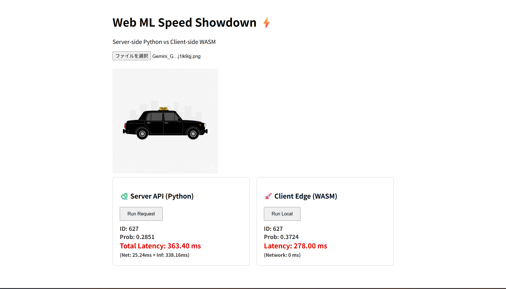

# webMLwasm

軽量なデモプロジェクト：サーバー（PyTorch/FastAPI）とクライアント（ONNX Runtime Web / WASM）で同じ画像分類モデル（ResNet18）を比較するためのサンプルです。



# 目的
- サーバーサイド推論（Python + PyTorch）とクライアントサイド推論（ブラウザ上の ONNX Runtime Web / WASM）を比較して、レイテンシの差を示すデモ。

リポジトリ構成（重要なファイル）
- `app.py` - FastAPI サーバー。画像アップロードで PyTorch による推論を行う。
- `models/` - ONNX モデルを配置するディレクトリ（`resnet18.onnx`, `resnet18.quant.onnx` など）。
- `scripts/export_model.py` - PyTorch モデルを ONNX に変換し（量子化も試みる）ためのスクリプト。
- `scripts/reexport_traced_onnx.py` - `torch.jit.trace` を使って安定した ONNX を再生成するスクリプト（本プロジェクトで問題を解決した方法）。
- `scripts/compare_preprocessing.py` - 前処理と出力の一致を検証するための比較スクリプト。
- `scripts/compare_preprocessing.py` と `scripts/reexport_traced_onnx.py` はデバッグ/検証用です。
- `static/` - フロントエンド（`index.html`, `main.js`, `style.css`）。ブラウザから推論を試せます。
- `requirements.txt` - Python 依存（開発環境用）
- `docs/ONNX_Export_Fix.md` - PyTorch↔ONNX の出力不一致を解消した手順の詳細ドキュメント。

# セットアップ（Windows のコマンド例）

1. 仮想環境の作成・有効化

```powershell
python -m venv venv
.\venv\Scripts\activate
```

2. 依存パッケージのインストール

```powershell
python -m pip install --upgrade pip setuptools wheel
python -m pip install -r requirements.txt
```

（注意）大きなパッケージ（`torch`, `torchvision`）は環境や CUDA 有無でインストールコマンドが異なります。必要に応じて公式ドキュメントを参照してください。

基本的な使い方

1. ONNX モデルを用意（既に `models/resnet18.onnx` がある場合は飛ばして良い）
   - 自分で生成する場合:
     ```powershell
     .\venv\Scripts\python.exe scripts\export_model.py
     ```
   - もし ONNX 変換で `quantize_dynamic` が失敗した場合、スクリプトはオリジナルONNXをコピーしてブラウザ向けファイルを作成します。

2. （必要に応じて）安定した ONNX を再生成（本リポジトリで出力不一致を解消した方法）

```powershell
.\venv\Scripts\python.exe scripts\reexport_traced_onnx.py
```

このスクリプトは `torch.jit.trace` を使い、レガシーエクスポーターを明示して ONNX ファイルを生成します（`models/resnet18_traced.onnx`）。生成後に本番ファイルへコピーしてください:

```powershell
Copy-Item models\resnet18_traced.onnx models\resnet18.onnx -Force
Copy-Item models\resnet18_traced.onnx models\resnet18.quant.onnx -Force
```

3. サーバー起動

```powershell
.\venv\Scripts\python.exe app.py
```

4. ブラウザで確認
- `http://localhost:8000` にアクセスし、画像をアップロード。
- 画面にサーバー（Python）とクライアント（WASM）の結果・レイテンシが表示されます。

検証スクリプト

- 前処理と出力が一致しているかを検証する:

```powershell
.\venv\Scripts\python.exe scripts\compare_preprocessing.py "path\to\image.jpg"
```

このスクリプトは PyTorch と ONNX の入力テンソル統計、logits の差分、top-1/top-5 を比較してデバッグ出力を表示します。

# 注意事項 / 既知の問題

- ONNX 量子化 (`onnxruntime.quantization.quantize_dynamic`) は PyTorch 2.x の出力（外部データ形式など）で shape inference エラーを起こすことがありました。詳細は `docs/ONNX_Export_Fix.md` を参照してください。
- 本プロジェクトでは最終的に `torch.jit.trace` + レガシーエクスポーターを使って ONNX を生成し、PyTorch と ONNX の出力を一致させました。
- ブラウザは大きなモデルファイルをキャッシュするため、モデルを差し替えた後はブラウザのハードリロード（`Ctrl+Shift+R`）や DevTools の `Disable cache` を使用してモデル再取得を行ってください。

# 評価・改善案

- 単一画像の top-1 確率が低い（例: 0.13）ことは必ずしも性能が低いことを意味しません。ImageNet の 1000 クラス分類では確率が分散しやすいです。複数画像で top-1 / top-5 を計測することを推奨します（`scripts` にある評価スクリプトを利用してください）。
- 量子化が必要なら `onnx-simplifier` を試したり、PyTorch 側で量子化した上でエクスポートする方法を検討できます。ただし、現状では量子化は必須ではありません（動作・比較は可能）。

開発に役立つコマンド

```powershell
# 仮想環境有効化
.\venv\Scripts\activate

# サーバ起動
python app.py

# モデル比較（単一画像）
python scripts\compare_preprocessing.py "C:\path\to\image.jpg"

# traced ONNX を生成
python scripts\reexport_traced_onnx.py
```

貢献・ライセンス

- このリポジトリは教育・デモ目的です。必要に応じてコードを改善して PR を送ってください。

---

